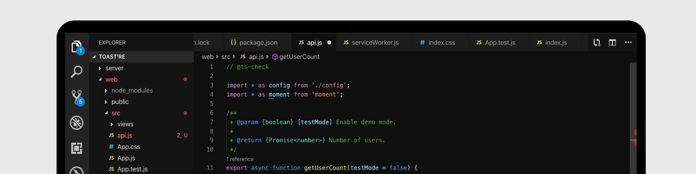

![alt text]

## About Me

Lorem ipsum dolor sit amet, consectetur adipiscing elit. Fusce tincidunt purus eu euismod malesuada. Praesent tincidunt, ligula non tincidunt euismod, mi metus tristique sem, quis tristique magna erat eget nisi. Ut ac ligula in lacus posuere volutpat ac sit amet erat. Phasellus ullamcorper eleifend arcu vel convallis. Aenean justo enim, sollicitudin ut placerat in, aliquam non eros. Nunc sollicitudin elit neque, ut dictum quam bibendum sit amet. Morbi at velit eget magna fermentum rhoncus nec laoreet dolor.

Aenean suscipit vel purus vitae faucibus. Maecenas id velit blandit, faucibus neque a, facilisis nisl. Donec sit amet congue turpis. Donec tristique metus sed tincidunt consequat. In blandit pellentesque est ut dignissim. Sed ut nibh elit. Suspendisse potenti. Mauris pharetra orci at consequat dapibus. Cras eget est finibus nulla rhoncus ultrices ac ut felis.

Sed facilisis urna vitae semper hendrerit. Aenean pretium dui sit amet nibh tempor pharetra. Nullam gravida vitae risus eu cursus. Morbi iaculis, ex at pharetra ultricies, sem lectus mollis felis, et fermentum magna orci nec odio. Aliquam erat volutpat. Fusce nec hendrerit sem, vitae convallis libero. Nulla cursus libero ut pharetra placerat. Donec tincidunt, lorem nec sollicitudin convallis, diam dolor volutpat libero, sed commodo tellus lectus in ex. Proin eleifend, ligula eu facilisis molestie, enim nibh sollicitudin augue, eu mattis eros lectus eget ante.

## My Skills

### FrontEnd Languages/Frameworks:

    
    
    
    
    
    

### BackEnd Languages/Frameworks:

    
    
    
    

### Environments/Others I work with:

    
    
    
    
    

