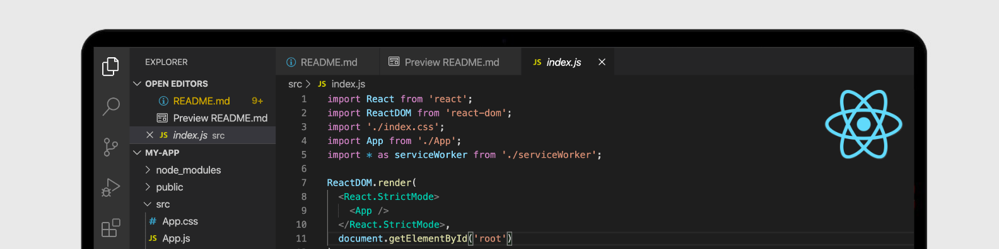

## About Me

Hello! I'm Jesús Cano, design engineer and project manager turned frontend developer specialized in ReactJs and React Native. I am focused on providing high fidelity solutions and delivery in consideration of the cost and time of the project. 

I'm co-founder of Worksut, a project based on a job search and recruitment application, where I currently work as CTO managing the different development projects and leading the web and mobile design teams. 

- 
Programming Skills: | Frontend: HTML5, CSS3, Sass, Bootstrap/Styled-Components, Webpack, JavaScript, ReactJS and React Native, Redux | Backend: Python, Flask, NodeJS, MySQL DB, API Rest | Version Control: Git and GitHub.

- 
UX and Design Skills: Figma, Adobe Xd, Photoshop, Illustrator, UX/UI design, user research, information architecture, user experience, visual design and interface design, wireframing, rapid prototyping, SEO (Web) & ASO (App).

- 
Management Skills: direction and project management, time, scope and cost in traditional methodologies (pmbok) and agile methodologies (scrum).

- 
Personal Skills (Soft Skills): hybrid profile (design and engineering), team player, creative storyteller, problem solving, critical thinker (and open to criticism).

## My Skills

<!--   -->

    

 
 
### Frontend Languages/Frameworks:

    &nbsp;&nbsp;
    &nbsp;&nbsp;
    &nbsp;&nbsp;
    &nbsp;&nbsp;
    &nbsp;&nbsp;
    

### Backend Languages/Frameworks:

    &nbsp;&nbsp;
    &nbsp;&nbsp;
    &nbsp;&nbsp;
    

### Environments/Others I work with:

    &nbsp;&nbsp;
    &nbsp;&nbsp;
    &nbsp;&nbsp;
    &nbsp;&nbsp;
    

